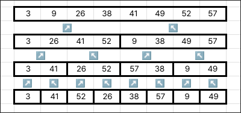

# 02 시작하기

## 연습문제 1

1. 그림 2.2를 모델로 이용해 수열 $A = \{31, 41, 59, 26, 41, 58\}$ 이 입력으로 주어질 때 INSERTION-SORT의 동작을 설명하라.
    ::: details 보기

    | 31 | 41 | 59 |`26`| 41 | 58 |
    |:--:|:--:|:--:|:--:|:--:|:--:|
    |:arrow_up:|:arrow_left:|:arrow_left:|:arrow_left:| | |

    26을 왼쪽 값과 비교해 더 작은 값이 없을 때 까지 자리를 바꾼다.

    | 26 | 31 | 41 | 59 |`41`| 58 |
    |:--:|:--:|:--:|:--:|:--:|:--:|
    | | | |:arrow_up:|:arrow_left:| |

    41을 왼쪽 값과 비교해 더 작은 값이 없을 때 까지 자리를 바꾼다.

    | 26 | 31 | 41 | 41 | 59 |`58`|
    |:--:|:--:|:--:|:--:|:--:|:--:|
    | | | | |:arrow_up:|:arrow_left:|

    58을 왼쪽 값과 비교해 더 작은 값이 없을 때 까지 자리를 바꾼다.

    | 26 | 31 | 41 | 41 | 58 | 59 |
    |:--:|:--:|:--:|:--:|:--:|:--:|

    종료
    :::

2. 수열을 오름차순 대신 내림차순으로 정렬하도록 INSERTION-SORT 프로시저를 재작성하라.
    ::: details 보기
    ```txt{6}
    INSERTION-SORT(A)
        for j = 2 to A.length
            key = A[j]
            // A[j]를 정렬된 배열 A[1..j - 1]에 삽입한다.
            i = j - 1
            while 0 < i and A[i] < key
                A[i + 1] = A[i]
                i = i - 1
            A[i + 1] = key
    ```

    A[i] 와 key를 비교하는 조건을 반전시키면 된다.
    :::

3. 다음의 검색 문제를 생각해보자.

    **입력:** $n$개 수들의 수열 $A = \{a_1, a_2, ..., a_n\}$ 과 어떤 값 $v$
    
    **출력:** $v=A[i]$ 를 만족하는 인덱스 $i$. $v$ 가 배열 $A$ 에 존재하지 않으면 특수값 $\text{NIL}$

    수열을 읽어보고 $v$ 값을 찾아보는 ***선형 검색*** 의사코드를 작성하고, 루프 불변성을 이용해 그 알고리즘이 타당함을 증명하라. 루프 불변성의 세 가지 특성을 만족하는지 반드시 확인해야 한다.

    ::: details 보기
    ```{txt}
    LINEAR-SEARCH(A, v)
        for i = 1 to A.length
            if A[i] == v
                return i
        return NIL
    ```

    **초기조건:**
        루프가 시작할 때 $i$ 값은 1이므로 부분 배열 $A[1..i - 1]$은 길이 0의 배열이 되고, 따라서 $A[1..i - 1]$에는 $v$ 가 존재하지 않는다.

    **유지조건:**
        매 루프마다 $A[i]$ 를 검사한다. 만약 $A[i]$ 가 $v$ 라면 바로 $i$를 반환한다. 아니라면 $A[1..i]$ 에는 $v$ 가 존재하지 않으므로 다음 루프에서도 $A[1..i - 1]$ 에는 $v$ 가 존재하지 않는다.

    **종료조건:**
        루프가 종료되는 시점에 $i$ 값은 $A.length + 1$이고 따라서 $A[1..i - 1]$ 는 전체 배열이 된다. 전체 배열에 $v$ 가 존재하지 않으므로 $\text{NIL}$ 을 반환한다.
    :::

4. 원소가 $n$ 개인 두 배열 $A$, $B$ 에 저장된 두 개의 $n$ 비트 이진수를 더하는 문제를 고려해 보자. 두 이진수의 합은 원소가 $n + 1$ 개인 배열 $C$ 에 이진수 형태로 저장되어야 한다. 이 문제를 엄밀하게 서술하고 두 정수의 합을 구하는 의사코드를 작성하라.

    ::: details 보기
    이진수를 저장하는 방법을 1의 자리는 1번 인덱스, 2의 자리는 2번 인덱스 4의 자리는 3번 인덱스 순으로 저장한다고 가정했을 때, 다음과 같은 코드로 두 정수의 합을 구할 수 있다.

    ```
    SUM(A, B)
        n = A.length // A와 B의 길이는 같다.
        C = [0; n + 1] // 0으로 초기화된 n + 1 길이의 배열
        carry = 0 // 올림 수

        for i = 1 to n
            if A[i] == B[i]
                C[i] = carry
                carry = A[i]
            else
                if carry == 1
                    C[i] = 0
                else
                    C[i] = 1
        C[i] = carry

        return C
    ```

    만약 A[i]와 B[i]가 같다면 둘 다 0이거나 1인 상황이다. 이때는 carry 값이 현재 자릿수가 된다. 그리고 다음 carry 값은 둘 다 1일 경우엔 1 아닐 경우엔 0이므로 그냥 A[i] 값을 사용하면 된다.

    만약 A[i]와 B[i]가 다르다면 둘 중에 하나는 무조건 1인 상황이다. 이때는 carry 값이 1이면 올림이 발생하여 현재 자릿수가 0이 되고 carry 값이 0이면 올림이 발생하지 않아 현재 자릿수가 1이 된다. carry 값에 변화가 생기지 않는다.
    :::

## 연습문제 2

1. 함수 $n^3/1000-100n^2-100n+3$ 을 $\Theta$ 표기법으로 나타내라.

    ::: details 보기
    $\Theta$ 표기법에서는 차수가 낮은 항과 차수가 가장 높은 항의 상수계수를 무시하므로 $\Theta(n^3)$ 이 된다.
    :::

2. 배열 $A$ 에 저장된 $n$ 개의 수를 정렬하는 알고리즘을 고려해보자. 먼저 $A$ 에서 가장 작은 원소를 찾아 $A[1]$ 과 바꾼다. 그리고 $A$ 에서 두 번째로 작은 원소를 찾아 $A[2]$ 와 바꾼다. 이 작업을 $A$ 의 $n - 1$ 개 원소를 바꿀 때 까지 계속한다. ***선택 정렬***이라고불리는 이 알고리즘에 대한 의사코드를 작성하라. 그리고 이 알고리즘이 어떤 루프 불변성을 유지하는지 설명하고, $n$ 개를 바꿀 때 까지 수행하지 않고 $n - 1$ 까지 바꾸면 되는이유를 설명하라. 마지막으로, 선택 정렬의 최선의 경우와 최악의 경우 수행시간을 $\Theta$ 표기법으로 각각 나타내라.

    ::: details 보기
    ```
    SELECTION-SORT(A)
        for i = 1 to A.length - 1
            min_idx = i

            // find i-th min value
            for j = i + 1 to A.length
                if A[min_idx] > A[j]
                    min_idx = j
            
            // swap
            tmp = A[i]
            A[i] = A[min_idx]
            A[min_idx] = tmp
    ```

    선택 정렬이 유지하는 루프 불변성은 $A[1..i]$ 에는 각각 $n$ 번째로 작은 원소가 들어가 있다는 것이다.

    $n$ 개를 바꿀 때 까지 수행하지 않고 $n - 1$ 까지 바꾸면 되는 이유는 $n - 1$ 까지 반복하면 $A[n]$ 에는 제일 큰 수가 이미 자리하고 있기 때문이다. 왜냐하면 루프 불변성을 유지하기 위해 $A[i]$ 에는 $i$ 번째로 작은 원소가 들어가 있기 때문이다. 

    선택 정렬의 최선의 경우, 최악의 경우 모두 동일하게 $\Theta(n^2)$ 의 수행시간을 가진다.

    :::

3. 선형 검색을 다시 생각해보자. 배열의 원소를 같은 확률로 검색한다고 가정하면 평균적으로 몇 개의 원소를 조사해야 하는가? 최악의 경우는 어떠한가? 선형 검색의 평균적인 경우와 최악의 경우 수행시간은 $\Theta$ 표기법으로 어떻게 나타내는가? 이 답을 증명하라.

    ::: details 보기
    LINEAR-SEARCH(A, v)의 $v$ 가 $A$ 의 $i$ 번째 원소라면 총 $i$ 번의 조사를 수행한 뒤 종료된다. 따라서 모든 경우의 수를 합하면 $n(n + 1)/2$ 이고 이를 $n$ 으로 나눈 $(n + 1)/2$ 가 평균적으로 조사하는 원소의 개수이다. 최악의 경우 검색하는 원소가 맨 마지막에 위치하므로 $n$ 번 조사하게 된다.

    선형 검색의 평균적인 경우와 최악의 경우는 모두 동일하게 $\Theta(n)$ 이다. 왜냐하면 차수가 낮은 항과 가장 높은 항의 상수 항은 모두 제거하므로 변수인 $n$ 만 남기 때문이다.
    :::

4. 최선의 경우에 알고리즘이 좋은 수행 시간을 갖게 하려면 어떻게 바꿔야 하는가?

    ::: details 보기
    최선의 경우는 항상 찾는 원소가 첫 번째 원소인 경우이다. 이때 바로 반환하면 $\Theta(1)$ 의 수행시간을 가지게 된다.
    :::

## 연습문제 3

1. 그림 2.4를 모델로 하여 배열 $A = \{3, 41, 52, 26, 38, 57, 9, 49\}$ 가 주어졌을 때 병합 정렬의 동작을 설명하라.

    ::: details 보기

    

    :::

2. MERGE 프로시저를, 경계값을 사용하지 않고 배열 $L$ 또는 $R$ 이 자신의 원소를 $A$ 로 모두 복사하면 비교 작업을 끝내고 나머지 배열에서 복사되지 않고 남은 원소를 $A$ 에 모두 복사하도록 재작성하라

    ::: details 보기
    ```
    MERGE(A, p, q, r)
        n1 = q - p + 1
        n2 = r - q

        배열 L[1..n1]과 R[1..n2]를 생성한다.

        for i = 1 to n1
            L[i] = A[p + i - 1]
        
        for j = 1 to n2
            L[j] = A[q + j]
        
        i = 1
        j = 1
        k = p

        while i <= n1 and j <= n2
            if L[i] <= R[j]
                A[k] = L[i]
                i += 1
            else
                A[k] = R[j]
                j += 1
            k += 1
        
        while i <= n1
            A[k] = L[i]
            i += 1
            k += 1
        
        while j <= n2
            A[k] = R[j]
            j += 1
            k += 1
    ```
    :::

3. $n$ 이 $2$ 의 거듭제곱일 때 수학적 귀납법을 이용해 다음 점화식의 해가 $T(n) = n \log_2 n$ 임을 보여라.

    $$
    T(n) = \begin{cases}
    2           &  n = 2 \\
    2T(n/2) + n &  n = 2^k, k \gt 1 \\
    \end{cases}
    $$

    ::: details 보기

    $$
    \begin{aligned}
    T(2) &= 2                                              &&= 2 \log_2 2\\
    T(4) &= 2 (T(2) + 2) &= 2 ((2 \log_2 2) + (2 \log_2 2)) &= 4 \log_2 4\\
    T(8) &= 2 (T(4) + 4) &= 2 ((4 \log_2 4) + (4 \log_2 2)) &= 8 \log_2 8 \\
    T(n) &= 2 (T(n / 2) + (n / 2)) &= 2 ((((n / 2) \log_2 (n / 2)) + ((n / 2) \log_2 2))) &= n \log_2 n\\ 
    \end{aligned}
    $$

    :::